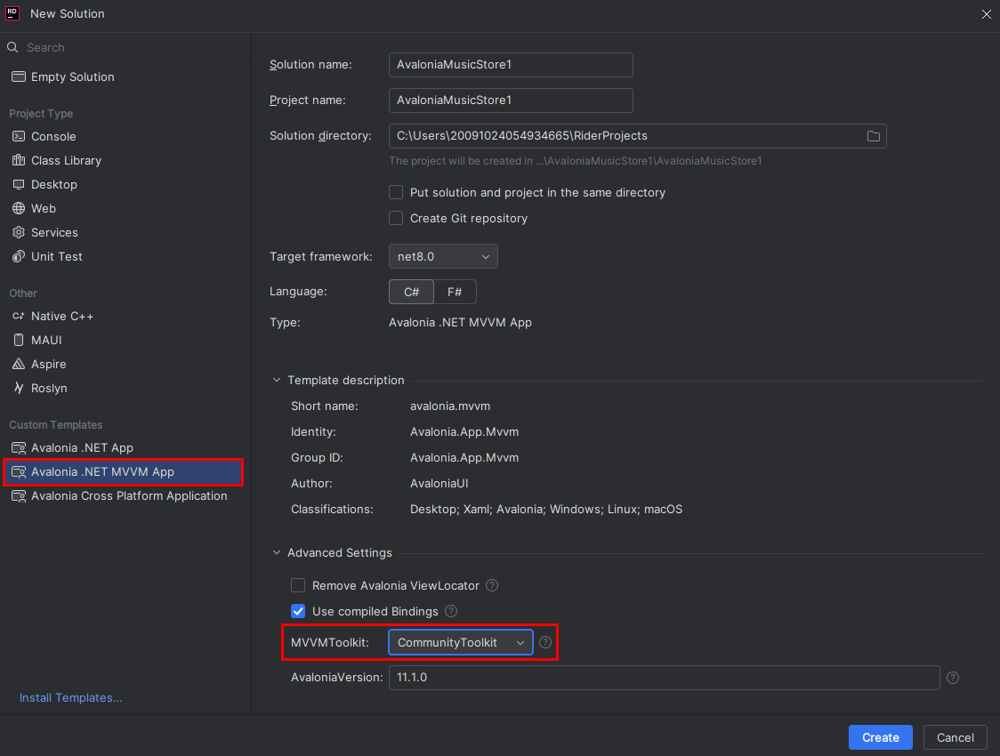

Este tutorial se basa en el ejemplo existente de la documentación oficial de AvaloniaUI donde se crea una [Music Store App](https://docs.avaloniaui.net/docs/tutorials/music-store-app/).

El objetivo es crear la misma aplicación, con las mismas funcionalidades, utilizando el CommunityToolkit, en lugar del ReactiveUI toolkit. Al final del tutorial se obtendrá una aplicación con el mismo comportamiento, salvo algunas mejoras y cambios en la interfaz, las mayores diferencias estarán en el código.

El proyecto totalmente finalizado se puede encontrar en el repositorio: [AvaloniaMusicStore](hhttps://github.com/GonGarce/AvaloniaTutorialttps://github.com/GonGarce/AvaloniaMusicStore)

## Community Toolkit

¿Qué es el Community Toolkit? Avalonia utiliza el patrón, o arquitectura, Movelo-Vista-VistaModelo (MVVM) en el que el ViewModel se conecta directamente con la vista, "sincronizando" sus propiedades y métodos de forma automática.

Para facilitar el desarrollo utilizando esta arquitectura ofrece un conjunto de herramientas denominadas _toolkit_. Incialmente se utilizaba de forma exclusivamente el toolkit de la librería ``ReactiveUI`` que ofrece muchas funcionalidades para la creación de propiedades reactivas.

En los últimos años ha tomado fuerza una nueva librería conocida como [CommunityToolkit](https://learn.microsoft.com/en-us/dotnet/communitytoolkit/mvvm/), ya que reduce el código boilerplate a la hora de crear propiedades y métodos reactivos.

## Herramientas

Para este proyecto se utilizará .NET versión 8 y el IDE Rider de Jetbrains, así como Avalonia en su versión 11.1.0.

## Crear el proyecto

A la hora de crear el nuevo proyecto, o solución, debemos recordar seleccionar la plantilla correcta, Avalonia MVVM App, y el Community Toolkit.

