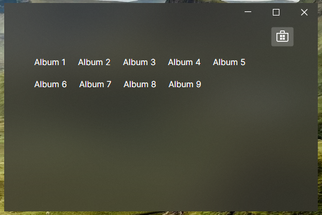

Ya tenemos todo lo necesario para que nuestra ventana principal funcione, pero la vista aún no muestra ningún dato ni responde a ninguna acción. Ahora veremos como enlazar la vista con el código usando el CommunityToolkit.

## Enlazar Eventos

Los eventos en Avalonia se denominan Comandos y utilizando el CommunityToolkit es muy fácil crear métodos que respondan a estos comandos.

Al contrario que con el ReactiveUI, no es necesario crear la comunicación reactiva de forma explícita, el toolkit se encarga de ello por nosotros, gracias al uso de anotaciones. En C#, las anotaciones se escriben dentro de ``[]``, en este caso usaremos la anotación ``[RelayCommand]``.

````cs title=MainWindowViewModel.cs
    [RelayCommand]
    private void BuyMusic()
    {
        Console.WriteLine("Buy music");
    }
````

Esto imprimirá un mensaje en la consola cada vez que pulsemos el botón. Pero aún falta conectarlo con la vista, debemos modificar nuestra vista para que el botón utilice este comando:

````xml title=MainWindow.xml {2}
        <Button HorizontalAlignment="Right" VerticalAlignment="Top"
                Command="{Binding BuyMusicCommand}">       
            <PathIcon Data="{StaticResource StoreMicrosoftRegular}" /> 
        </Button>
````

:::note
Fíjate que en la vista utilizamos el nombre ``BuyMusicCommand`` mientras que nuestro método se llama ``BuyMusic``. Esto se debe a que el CommityToolkit crea todo el código necesario para tener una implementación reactiva, al igual que debemos hacer nosotros de forma explícita cuando usamos el ReactiveUI, entre otras cosas crea un método ``BuyMusicCommand`` que podemos conectar con nuestra vista.
:::

Al hacer esto nuestro proyecto dejará de funcionar, es necesario añadir el modificador ``partial`` a nuestra clase, ya que el CommunityToolkit está generando otra clase homónima con código adicional:

````cs title=MainWindowViewModel.cs
public partial class MainWindowViewModel : ViewModelBase
{
````

Ahora sí, ya está listo para ser probado y nuestro botón responderá correctamente.

## Enlazar datos

Ahora haremos que nuestra lista de elementos muestre algo de información. De momento solo vamos a mostrar algunos textos pero más adelante mostraremos la información de cada album como en el proyecto de ejemplo.

Crearemos una lista de elementos de texto, para enlazarla con la vista, de momento lo haremos de forma manual, por ejemplo:

````cs title=MainWindowViewModel.cs
    [ObservableProperty]
    private List<TextBlock> _albums = [
        new TextBlock() { Text = "Album 1" },
        new TextBlock() { Text = "Album 2" },
        new TextBlock() { Text = "Album 3" },
        new TextBlock() { Text = "Album 4" },
        new TextBlock() { Text = "Album 5" },
        new TextBlock() { Text = "Album 6" },
        new TextBlock() { Text = "Album 7" },
        new TextBlock() { Text = "Album 8" },
        new TextBlock() { Text = "Album 9" }
    ];
````

En este caso hacemos uso de la anotación ``ObservableProperty`` para que el toolkit cree todo el código boilerplate por nosotros. Observa que la propiedad está definida como privada, con lo que no será accesible desde la vista, esto es correcto, ya que por detrás se está creando una propiedad pública ``Albums`` que podremos utilizar y además será reactivo.

Así, en nuestra vista basta con hacer el siguiente cambio.

````xml title=MainWindow.xml
<ItemsControl Margin="0 40 0 0" ItemsSource="{Binding Albums}">
````

Nuestros textos están muy juntos, así que añadiremos un estilo para separarlos un poco, podemos añadir un estilo que aplique solo a los elementos dentro del ``ItemsControl`` de la siguiente manera:

````xml title=MainWindow.xml
    <ItemsControl Margin="0 40 0 0" ItemsSource="{Binding Albums}">
        <ItemsControl.ItemsPanel>
            <ItemsPanelTemplate>
                <WrapPanel />
            </ItemsPanelTemplate>
        </ItemsControl.ItemsPanel>
        <ItemsControl.Styles>
            <Style Selector="TextBlock">
                <Setter Property="Margin" Value="10,10,10,10"></Setter>
            </Style>
        </ItemsControl.Styles>
    </ItemsControl>
````

De esta forma añadimos un margen de ``10`` por cada lado a todos los componentes ``TextBlock`` que estén en el ``ItemsControl``. Podemos ejecutarlo y probarlo, veremo que los textos pasan a la siguiente línea cuando la ventana es demasiado pequeña.


