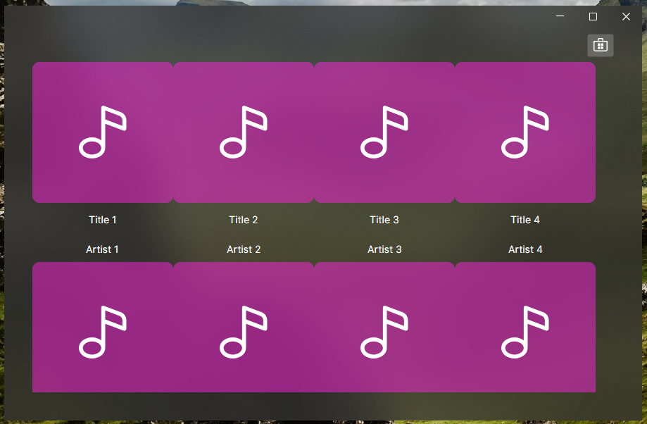
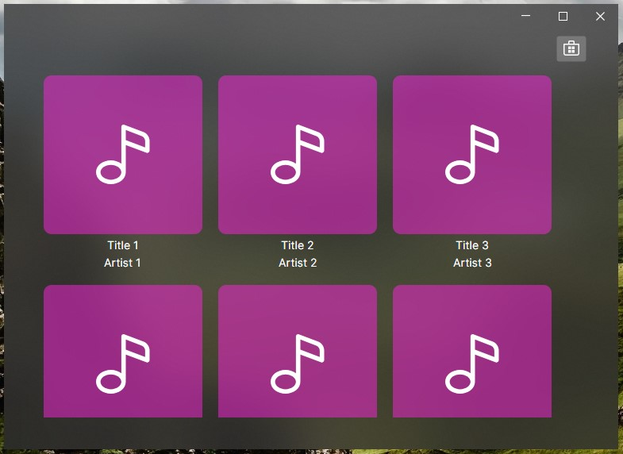

Ahora que hemos creado las clases necesarias para representar nuestros albumes, podemos empezar a utilizarlas.

## Actualizar el ViewModel

De momento seguiremos mostrando datos de prueba, pero ya podemos cambiar nuestra lista de ``TextBlock`` por una lista de ``AlbumViewModel``. Sí, la lista no contiene al modelo ni a la vista, los ViewModel no deben interactuar con las vistas directamente, solo deben comunicarse con otros ViewModel, tampoco nos serviría de nada tener una lista con los modelos, ya que no tendríamos información de la aplicación y sus componentes, solo de los datos de los albumes.

Piensa en los ViewModel como si fuesen los componentes de nuestra aplicación. Así pues, basta con modificar nuestra lista, por ejemplo con la siguiente información:

````cs title=MainWindowViewModel.cs
    [ObservableProperty]
    private List<AlbumViewModel> _albums = [
        new AlbumViewModel(new Album("Artist 1", "Title 1", "")),
        new AlbumViewModel(new Album("Artist 2", "Title 2", "")),
        new AlbumViewModel(new Album("Artist 3", "Title 3", "")),
        new AlbumViewModel(new Album("Artist 4", "Title 4", "")),
        new AlbumViewModel(new Album("Artist 5", "Title 5", "")),
        new AlbumViewModel(new Album("Artist 6", "Title 6", "")),
        new AlbumViewModel(new Album("Artist 7", "Title 7", "")),
        new AlbumViewModel(new Album("Artist 8", "Title 8", "")),
        new AlbumViewModel(new Album("Artist 9", "Title 9", "")),
    ];
````

## Actualizar la Vista

Si vamos a nuestra vista (``MainWindow.axaml``) y reconstruimos nuestro proyecto (``build``), veremos que los ``TextBlock`` desaparecen automáticamente para mostrarse ya nuestro albumes. La aplicación, de alguna forma supo que nuestra lista de ``AlbumViewModel`` debía representarse con la vista ``AlbumView``.

Podrías pensar que esto se debe a la conexión View-ViewModel que establecimos anteriormente ``x:DataType="vm:AlbumViewModel"``, pero no es así, esa conexión solo es para la propia vista. Entonces ¿cómo supo que vista utilizar?

La resolución de vistas se realiza a través del ``ViewLocator``, en la raíz de nuestro proyecto existe una clase ``ViewLocator.cs`` que viene con una configuración por defecto para esta plantilla. Si nos fijamos en la siguiente línea:

````cs title=ViewLocator.cs
var name = data.GetType().FullName!.Replace("ViewModel", "View", StringComparison.Ordinal);
````

Realiza una sustitución completa del texto ```ViewModel`` por ``View``, por eso necesario que nuestras vistas estén dentro del directorio ``Views`` y sigan la nomenclatura ``XXXView``. Si nuestra vista se llamase por ejemplo ``ViewAlbum.axaml``, la resolución fallaría y nos encontraríamos con el siguiente error ``Not Found: Avalonia.MusicStore.Views.AlbumView``.

Esta es una convención para este tipo de proyectos y la configuración por defecto se puede modificar, por ejemplo si estuviesemos creando una aplicación xplatform, podríamos crear vistas para distintos tipos de dispositivos y utilizarlas solo en esa plataforma añadiendo algo así:

````cs title=ViewLocator.cs
    if (OperatingSystem.IsAndroid())
    {
        name = data.GetType().Namespace + ".Android." +
            data.GetType().Name.Replace("ViewModel", "View", StringComparison.Ordinal);
        type = Type.GetType(name);
    }
````

En esta aplicación no será nacesario modificar el ``ViewLocator`` o podemos seguir con la configuración por defecto siempre que apliquemos las normas de nombrado mencionadas anteriormente.

## Actualizar los estilos

Nuestra vista funcionó sin que tuviesemos que hacer ningún cambio, pero si nos fijamos, hay algún problema con los estilos, no hay espacio entre los albumes y los textos tienen mucho margen.



Esto se debe a que el margen que añadimos antes aplica a los componentes ``TextBlock``, por eso los textos tienen tanto margen y los albumes ninguno, debemos modificarlo para que aplique a nuestros ``AlbumView``.

````xml title=MainWindow.axaml ins={3} del={2}
<ItemsControl.Styles>
    <Style Selector="TextBlock">
    <Style Selector="views|AlbumView">
        <Setter Property="Margin" Value="10,10,10,10"></Setter>
    </Style>
</ItemsControl.Styles>
````


