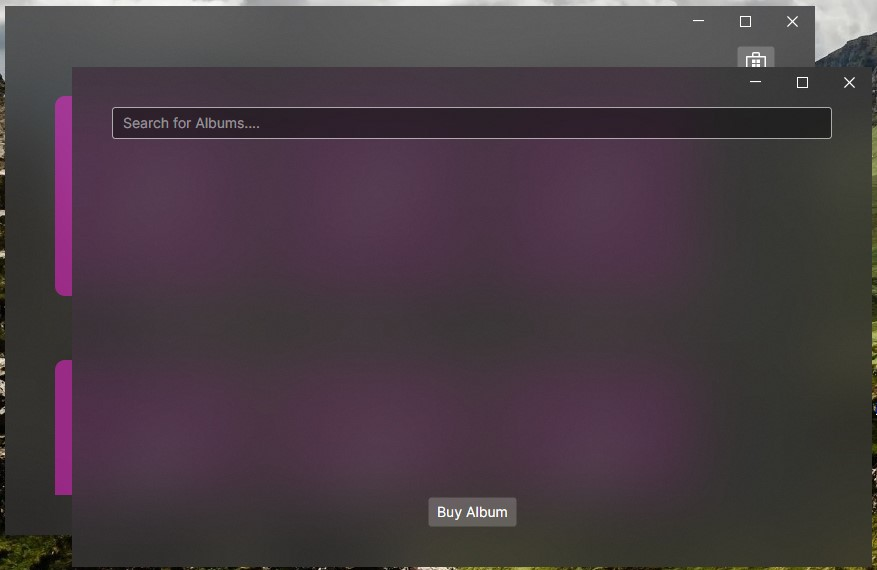

Abrir un diálogo o una nueva ventana no es una tarea complejo en Avalonia, la dificultad aparece cuando queremos esperar por un resultado, como en este caso, queremos abrir una ventana modal que nos devuelva el album seleccionado para añadirlo a nuestra colección.

Esta interacción es uno de los puntos débiles del CommunityToolkit y no provee ninguna herramienta o facilidad para gestionarlo, por ello es necesario coger algunas utilidades prestadas del ReactiveUI.

## Crear una interfaz de interacción

Necesitamos crear una interfaz de comunicación con la nueva ventana, para poder invocarla desde nuestro ViewModel y recibir un resultado. así que vamos a crear una nueva clase ``Interaction.cs``, inspirada en la propia implementación del ReactiveUI.

````cs title=Interaction.cs
using System;
using System.Threading.Tasks;
using System.Windows.Input;

/// <summary>
/// Simple implementation of Interaction pattern from ReactiveUI framework.
/// https://www.reactiveui.net/docs/handbook/interactions/
/// </summary>
public sealed class Interaction<TInput, TOutput> : IDisposable, ICommand
{
    // this is a reference to the registered interaction handler.
    private Func<TInput, Task<TOutput>>? _handler;

    /// <summary>
    /// Performs the requested interaction <see langword="async"/>. Returns the result provided by the View
    /// </summary>
    /// <param name="input">The input parameter</param>
    /// <returns>The result of the interaction</returns>
    /// <exception cref="InvalidOperationException"></exception>
    public Task<TOutput> HandleAsync(TInput input)
    {
        if (_handler is null)
        {
            throw new InvalidOperationException("Handler wasn't registered");
        }

        return _handler(input);
    }

    /// <summary>
    /// Registers a handler to our Interaction
    /// </summary>
    /// <param name="handler">the handler to register</param>
    /// <returns>a disposable object to clean up memory if not in use anymore/></returns>
    /// <exception cref="InvalidOperationException"></exception>
    public IDisposable RegisterHandler(Func<TInput, Task<TOutput>> handler)
    {
        if (_handler is not null)
        {
            throw new InvalidOperationException("Handler was already registered");
        }

        _handler = handler;
        CanExecuteChanged?.Invoke(this, EventArgs.Empty);
        return this;
    }

    public void Dispose()
    {
        _handler = null;
    }

    public bool CanExecute(object? parameter) => _handler is not null;

    public void Execute(object? parameter) => HandleAsync((TInput?)parameter!);

    public event EventHandler? CanExecuteChanged;
}
````

No hace falta entrar en detalles, basta con saber que esta clase es una abstracción para los ViewModel, ya que, como dijimos, estos no pueden saber nada de las vistas, y por ende no pueden saber nada de las ventanas.

Ahora podemos añadir los siguientes cambios a nuestro ViewModel:

````cs title=MainWindowViewModel.cs
    public MainWindowViewModel()
    {
        ShowDialog = new Interaction<MusicStoreViewModel, AlbumViewModel?>();
    }

    /// <summary>
    /// Gets an instance of our own Interaction class
    /// </summary>
    public Interaction<MusicStoreViewModel, AlbumViewModel?> ShowDialog { get; }

    [RelayCommand]
    private void BuyMusic()
    {
        var store = new MusicStoreViewModel();
        ShowDialog.HandleAsync(store);
    }
````

Como vemos, en ningún momento se referencia a las vistas o ventanas en el ViewModel, simplemente creamos un objeto de interacción que creará un ``MusicStoreViewModel`` y recibirá un ``AlbumViewModel`` de forma opcional, puede ser nulo cuando no se elige ningún album.

## Crear y abrir la ventana

Si probamos a pulsar el botón ahora, no funcionará, de hecho lanzará un error, porque estamos llamando a ``HandleAsync`` en nuestro objeto de interacción sin haber registrado un manejador antes ``RegisterHandler``.

Es decir, nuestro ViewModel tiene lo necesario para iniciar la interacción, pero no hemos definido como se debe resolver. Esta parte no se puede hacer en el ViewModel, porque implicar manejar objetos de la vista como la ventana, así que ¿dónde añadimos ese código?

Ese código debe ir en el [_Code-behind_](https://docs.avaloniaui.net/docs/basics/user-interface/code-behind), un código que existe asociado a cada una de las vistas. En la mayoría de los casos no necesitamos manipular esta parte del código, pero existe para estas ocasiones en las que es necesario añadir lógica asociada exclusivamente a una vista.

Vamos a añadir lógica a la vista de la ventana principal, en concreto la lógica para gestionar la creación de la nueva ventana y abrirla como un diálogo.


Añadiremos el siguiente código a nuestra ventana principal:

````cs title=MainWindow.axaml.cs
    // Stores a reference to the disposable in order to clean it up if needed
    IDisposable? _dialogInteractionDisposable;

    protected override void OnDataContextChanged(EventArgs e)
    {
        // Dispose any old handler
        _dialogInteractionDisposable?.Dispose();

        if (DataContext is MainWindowViewModel vm)
        {
            // register the interaction handler
            _dialogInteractionDisposable =
                vm.ShowDialog.RegisterHandler(InteractionHandler);
        }

        base.OnDataContextChanged(e);
    }
    
    private async Task<AlbumViewModel?> InteractionHandler(MusicStoreViewModel vm)
    {
        var dialog = new MusicStoreWindow();
        dialog.DataContext = vm;

        var result = await dialog.ShowDialog<AlbumViewModel?>(this);
        
        return result;
    }
````

En primer lugar, en ``OnDataContextChanged`` registramos el manejador de la interacción, en caso de que la ventana se destruya y vuelva a crear (cambios de orientaciones, etc.) lo liberamos y lo volvemos a registrar.

En segundo lugar, definimos nuestro manejador, que es una función que recibe el ViewModel de la nueva ventana (será el que creamos al pulsar el botón), crea la nueva ventana y se lo asocia, para acto seguido mostrar esa ventana en modo diálogo ``ShowDialog``. Este es el punto concreto en el que se abre la ventana, como no podía ser de otra forma debe hacerse en la vista, ya que los ViewModel deben ser agnósticos de todo lo relacionado con las vistas.

¡Si pulsamos el botón ahora nuestra nueva ventana se abrirá correctamente!


