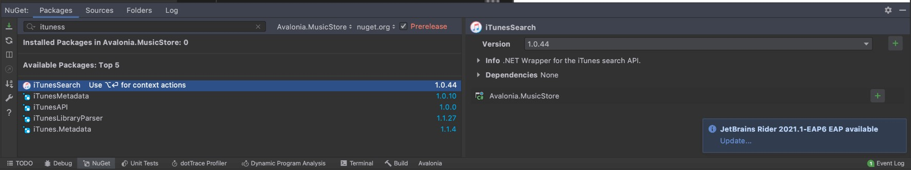
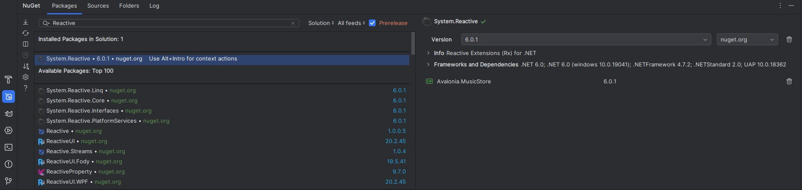
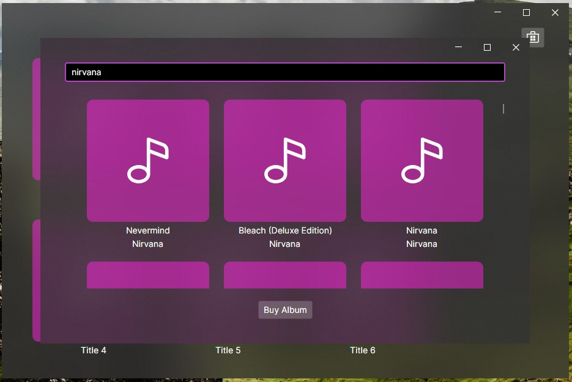

Ahora que tenemos la nueva ventana lista es hora de conectarla con el servicio de búsqueda de música y mostrar los resultados en nuestra lista.

## Añadir el servicio de iTunes

Al igual que en el tutorial original, vamos a utilizar el servicio de música de iTunes que tiene disponible una librería para C#. La añadiremos a nuestro proyecto como se indica en dicho [ejemplo](https://docs.avaloniaui.net/docs/tutorials/music-store-app/searching-for-albums).



## Llamar al servicio de búsqueda

En este caso, para separar nuestro modelo de la implementación concreta de la búsqueda de música, vamos a crear una nueva clase que se encargará de la integración con iTunes. Para ello creamos un nuevo fichero ``Services/AlbumService.cs``.

````cs title=AlbumService.cs
using System.Collections.Generic;
using System.Diagnostics;
using System.Linq;
using System.Net.Http;
using System.Threading.Tasks;
using Avalonia.MusicStore.Models;
using iTunesSearch.Library;

namespace Avalonia.MusicStore.Services;

public class AlbumService
{
    private static iTunesSearchManager _searchManager = new();
    private static HttpClient s_httpClient = new();
    
    public static async Task<IEnumerable<Album>> SearchAsync(string searchTerm)
    {
        Debug.Print("SearchAsync");
        var query = await _searchManager.GetAlbumsAsync(searchTerm)
            .ConfigureAwait(false);

        return query.Albums.Select(x =>
            new Album(x.ArtistName, x.CollectionName, 
                x.ArtworkUrl100.Replace("100x100bb", "600x600bb")));
    }
}
````

El código es sencillo, este servicio llama al servicio de iTunes y devuelve un conjunto de álbumes, en concreto de nuestro Modelo ``Album``, de esta forma el resto de nuestra aplicación es agnóstica de esta integración y trabaja solo con los objetos de nuestro dominio.

## Buscar y mostrar resultados

Con nuestro servicio creado ya solo falta llamarlo desde nuestro ViewModel para actualizar la lista de resultados.

````cs title=MusicStoreViewModel.cs
    partial void OnSearchTextChanged(string? value)
    {
        Search(value);
    }

    private async void Search(string? query)
    {
        IsBusy = true;
        SearchResults = [];

        if (!string.IsNullOrWhiteSpace(query))
        {
            var albums = await AlbumService.SearchAsync(query);
            SearchResults = albums.Select(album => new AlbumViewModel(album)).toArray();
        }

        IsBusy = false;
    }
````

Es importante fijarse en el método ``OnSearchTextChanged``, observa que está definido como ``partial``, al igual que nuestra clase, esto se debe a que es un método sobreescrito de la clase padre, el community toolkit pone a nuestra disposición un conjunto de métodos para reaccionar a los cambios de las propiedades que anotemos como ``ObservableProperty``, así para cada una de ellas contamos con métodos análogos. Si hacemos ``Ctrl+Click`` en el método podemos ver el resto de métodos disponibles.

En la búsqueda recibimos la lista de álbumes y la convertimos en un array de ViewModels ``albums.Select(album => new AlbumViewModel(album)).toArray();``, además de actualizar la propiedad ``IsBusy`` mientras está buscando.

## Tiempo de espera entre búsquedas

Aunque nuestra búsqueda funciona tiene un grave problema, se está llamando al servicio externo cada vez que se pulsa una tecla. Esto a parte de ser muy ineficiente y sobrecargar el servicio de iTunes, desmejora la solución del tutorial de ReactiveUI, donde se espera a que el usuario termine de escribir.

En el ejemplo original utilizan la funcionalidad ``WhenAnyValue``, pero esta es una herramienta de ReactiveUI, así que en nuestro caso no podemos utilizar esta solución. Hay distintas opciones, pero una forma elegante de resolverlo es utilizando observables, con la librería ``System.Reactive``.

Debemos agregar esta librería a nuestro proyecto, a través de NuGet, de forma análoga a como añadimos el servicio de iTunes.



Esta librería nos permite crear objetos reactivos, ``Subjects``, bajo demanda. En nuestro caso crearemos un ``Subject`` que emita valores cada vez que se modifique el texto de búsqueda

````cs title=MusicStoreViewModel.cs
    private const int DebounceDelay = 500; // Typing wait time
    private readonly Subject<string?> _searchTextSubject = new(); // Search term changes stream

    public MusicStoreViewModel()
    {
        _searchTextSubject
            .Throttle(TimeSpan.FromMilliseconds(DebounceDelay)) // Wait to stop typing
            .DistinctUntilChanged() // Only search when term has changed
            .Subscribe(Search);
    }
````

Y modificamos el método que reacciona a los cambios en la búsqueda para que en lugar de llamar directamente al método de buscar, emita los cambios al ``Subject``.

````cs title=MusicStoreViewModel.cs
    partial void OnSearchTextChanged(string? value)
    {
        // Every time search text changes notify the subject
        _searchTextSubject.OnNext(value);
    }
````

De esta forma, cada vez que cambia el texto de búsqueda se emite un nuevo valor a nuestro ``Subject``, al que está suscrito el método ``Search``, lo que quiere decir que cada vez que este subject emita un nuevo valor se ejecutará ese método.

Sin embargo, hemos añadido dos filtros para descartar valores:
* ``Throttle``: Ignora todos elementos de la secuencia que se emitan en menos del tiempo especificado, también conocido como ``Debounce``, nos sirve para esperar, por ejemplo, a que el usuario deje de escribir.
* ``DistinctUntilChanged``: Omite todos los valores mientras no sean distintos al anterior.

Con estos filtros evitamos llamar al servicio de búsqueda de forma innecesaria.

Ahora sí, nuestra búsqueda está lista, a falta de mostrar las portadas de los álbumes.


