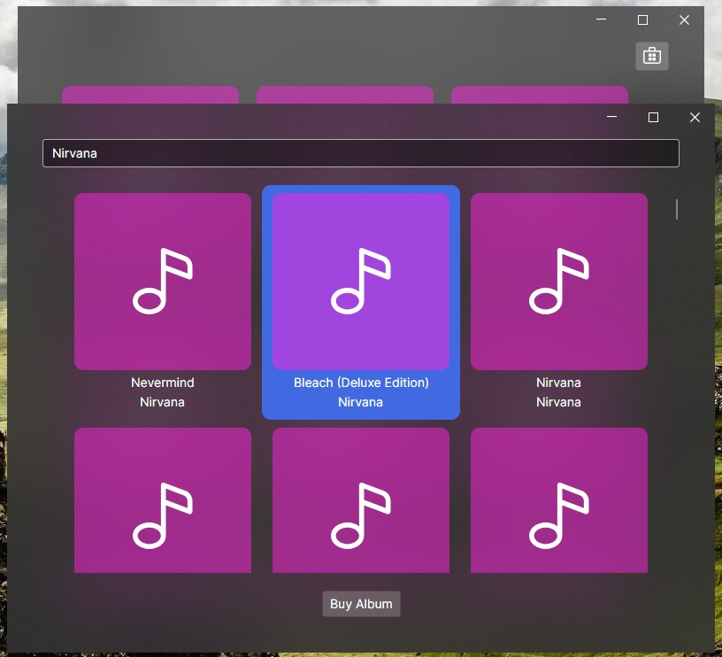
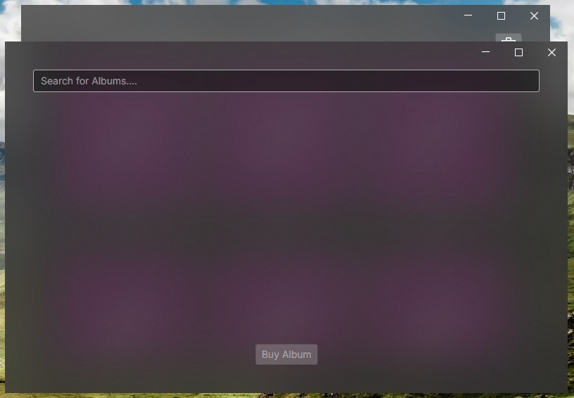

Nuestra búsqueda ya funciona y mostramos los discos que encuentra en la lista. Si te fijas el componente ``ListBox`` ofrece de serie resaltado y selección de elementos, lo que es fantástico porque son cosas que necesitamos para nuestra aplicación, pero los estilos que tiene de serie podrían mejorarse con unos pequeños cambios.

## Estilo del resaltado y seleccionado

Nuestras portadas se muestra con esquinas redondeadas, así que, las esquinas rectas del resaltado desentonan un poco. Además, el color del elemento selccionado es muy similar al del fondo que se muestra cuando la imagen no existe. Podemos cambiar estas dos cosas fácilmente modifcando los estilos de la lista.

````xml title=MusicStoreWindow.axaml {10-17}
<ListBox ItemsSource="{Binding SearchResults}"
         SelectedItem="{Binding SelectedAlbum}"
         Background="Transparent"
         Margin="0 20">
    <ListBox.ItemsPanel>
        <ItemsPanelTemplate>
            <WrapPanel HorizontalAlignment="Center" />
        </ItemsPanelTemplate>
    </ListBox.ItemsPanel>
    <ListBox.Styles>
        <Style Selector="ListBoxItem:selected /template/ ContentPresenter">
            <Setter Property="Background" Value="RoyalBlue" />
        </Style>
        <Style Selector="ListBoxItem">
            <Setter Property="CornerRadius" Value="10" />
        </Style>
    </ListBox.Styles>
</ListBox>
````

El selector ``ListBoxItem:selected /template/ ContentPresenter`` aplica solo al elemento seleccionado. El selector ``:selected`` es similar a html, existen otros como ``:active``, ``:focus``, etc.

La parte de ``/template/ ContentPresenter`` es necesario ya que en el componente ``ListBox`` el estilo del fondo del elemento seleccionado aplica sobre esa plantilla. Ya que es código abierto, podemos ir y consultar estos detalles en cualquier momento, si consultamos el código de ``ListBoxItem.xaml`` veremos algo así:

````xaml title=ListBoxItem.xaml
    <!--  Selected State  -->
    <Style Selector="^:selected">

      <Style Selector="^ /template/ ContentPresenter#PART_ContentPresenter">
        <Setter Property="Background" Value="{DynamicResource SystemControlHighlightListAccentLowBrush}" />
        <Setter Property="Foreground" Value="{DynamicResource SystemControlHighlightAltBaseHighBrush}" />
      </Style>
````

Con estos cambios, se ve mucho mejor.



## Botón de comprar

El botón de comprar podría mejorarse con algún icono, haciendolo más grande o llamativo, etc., pero de momento vamos a centrarnos en lo más importante, que solo esté activo cuando hay un álbum seleccionado. Ahora mismo está activo en todo momento, aunque no hayamos seleccionado ningún álbum, vamos a solucionar eso.

El Community Toolkit pone a nuestra disposición una serie de utilidades para aprovechar el enlace entre los comandos y las propiedades en estos casos.

En primer lugar, recordemos como está conectada nuestra vista con el ViewModel:

````xml title=MusicStoreWindow.axaml {4,7}
<Button Content="Buy Album" 
        DockPanel.Dock="Bottom" 
        HorizontalAlignment="Center"
        Command="{Binding BuyMusicCommand}"/>

<ListBox ItemsSource="{Binding SearchResults}"
         SelectedItem="{Binding SelectedAlbum}"
         Background="Transparent"
         Margin="0 20">
````

El botón está correctamente conectado con nuestro método y el elemento seleccionado de la lista también. Así que introduciendo los siguientes cambios en el código debería funcionar automáticamente.

````cs title=MusicStoreViewModel.cs ins={2,5} ins="(CanExecute = nameof(CanBuy))"
    [ObservableProperty]
    [NotifyCanExecuteChangedFor(nameof(BuyMusicCommand))]
    private AlbumViewModel? _selectedAlbum;

    private bool CanBuy => SelectedAlbum != null;

    [RelayCommand(CanExecute = nameof(CanBuy))]
    private void BuyMusic()
    {
        // Close and send album
    }
````

El código es bastante autoexplicativo, con la propiedad ``CanExecute`` podemos proveer un método que devuelva un booleano, para condicionar la ejecución de dicho comando, que solo podrá ser invocado cuando sea verdadero. Además es encesario añadir la anotación ``NotifyCanExecuteChangedFor`` para que se actualice dicho valor siempre que la propiedad sea modificada.

:::tip
``NotifyCanExecuteChangedFor``, como su nombre indica, se utiliza para notificar a los comandos con la propiedad ``CanExecute``, además existen más anotaciones para otros casos de uso; por ejemplo contamos con ``NotifyPropertyChangedFor`` para actualizar propiedades que dependan de otras y así evitar el uso de métodos como ``OnPropertyChanged``.
:::

¿Tendrá algún impacto esto en la vista? Lo increíble es que sí, si el comando está conectado a un botón, este tendrá el estado inactivo siempre que el ``CanExecute`` se evalúe como falso. Ahora nuestro botón está desativado cuando no hay ningún álbum seleccionado.


