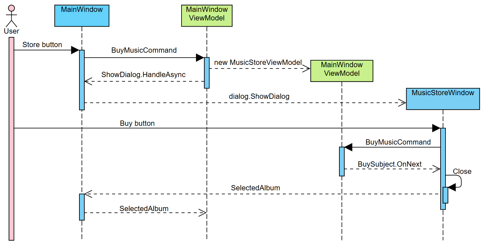
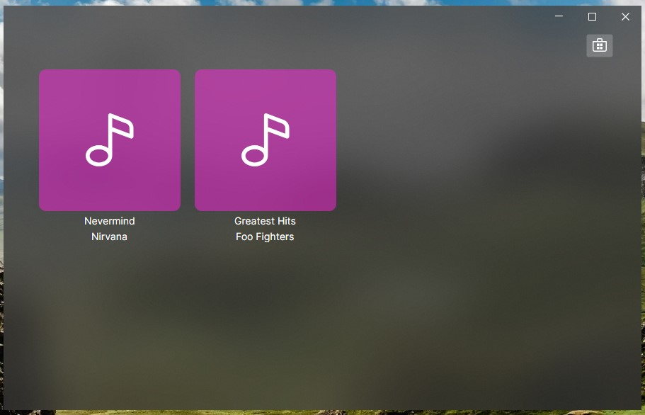

Para implementar la compra del los álbumes, o añadirlos a nuestra biblioteca, lo primero es notificar a la ventan principal el álbum seleccionado al pulsar el botón de comprar.

## Cerrar el diálogo

La primera dificultad reside en cerrar el diálogo desde el ViewModel, ya que este último no debe mantener referencias a la ventana ni comunicarse con ella.

Entonces, ¿cómo notificamos la voluntad de cerrar el diálogo cuando pulsamos el botón y el ViewModel recibe el comando? Hay varias formas de resolver esta dependencia, pero todas pasan por añadir cierta lógica al _code behind_ de la ventana.

La ventana sí conoce la relación entre la vista y el ViewModel, y desde el ``code behind`` podemos obtener una referencia del ViewModel correspondiente para reaccionar a algún evento; de hecho, eso es lo que vamos a hacer.

En el ViewModel crearemos un nuevo ``Subject`` que usaremos para notificar a la vista de cuando se pulsa el botón de comprar.

````cs title=MusicStoreViewModel.cs
    public readonly Subject<AlbumViewModel> BuySubject = new();

    // ...
    [RelayCommand(CanExecute = nameof(CanBuy))]
    private void BuyMusic()
    {
        BuySubject.OnNext(SelectedAlbum);
    }
````

Al recibir el comando de comprar enviamos el álbum seleccionado a través de nuestro ``Subject``, ahora solo falta que la ventana se suscriba para recibir el evento y cerrar la ventan.

````cs title=MusicStoreWindow.axaml.cs {10}
    private IDisposable? _subscription;

    protected override void OnDataContextChanged(EventArgs e)
    {
        Debug.Print("MusicStoreWindow:OnDataContextChanged");
        _subscription?.Dispose();

        if (DataContext is MusicStoreViewModel vm)
        {
            _subscription = vm.BuySubject.Subscribe(model => Close(model));
        }

        base.OnDataContextChanged(e);
    }

    protected override void OnUnloaded(RoutedEventArgs e)
    {
        _subscription?.Dispose();
        base.OnUnloaded(e);
    }
````

En la creación de la ventana, o cualquier cambio de contexto, no suscribimos al ``Subject``, para que cuando recibamos un elemento, cerrar la ventana y pasar el ``AlbumViewModel`` recibido como resultado. Si consultamos la documentación de ``Close`` dice:

````cs
//Closes a dialog window with the specified result.
public void Close(object? dialogResult)
````

Además, se ha añadido el código necesario para liberar la suscripción cuando la ventana cambia de contexto o se cierra, de lo contrario podríamos acabar con suscripciones activas en memoria que referencian a componentes que ya no existen.

Con esto, la comunicación entre nuestro ViewModel y nuestra vista está completa y ya se cerrará cuando pulsemos el botón, además de enviar el álbum seleccionado como resultado del diálogo. Solo queda una pequeña mejora que podemos hacer en el código, y que probablemente el IDE ya nos sugiera:


````cs title=MusicStoreWindow.axaml.cs del={1} ins={2}
_subscription = vm.BuySubject.Subscribe(model => Close(model));
_subscription = vm.BuySubject.Subscribe(Close);
````

## Recibir y añadir el álbum a la lista

Si recordamos como habíamos definido el manejador de la interacción:

````cs title=MainWindow.axaml.cs
    private async Task<AlbumViewModel?> InteractionHandler(MusicStoreViewModel vm)
    {
        var dialog = new MusicStoreWindow();
        dialog.DataContext = vm;

        var result = await dialog.ShowDialog<AlbumViewModel?>(this);

        return result;
    }
````

En ``result`` recibiremos el resultado del diálogo y lo devolvemos como resultado de la interacción, así que, cuando finalice esta interacción, nuestro ViewModel recibirá automáticamente el resultado del diálogo; solo nos falta recoger esa información y añadir el álbum a la lista.

````cs title=MainWindowViewModel.cs
    [RelayCommand]
    private async Task BuyMusic()
    {
        var store = new MusicStoreViewModel();

        var result = await ShowDialog.HandleAsync(store);
        if (result != null)
        {
            Albums.Add(result);
        }
    }
````

Por resumir, la interacción entre las dos ventanas sigue el flujo del gráfico.



Ahora nuestros álbumes deberían mostrarse en la lista cuando los añadimos, pero... **¡¿por qué no es así?!**

## Colecciones Observables

Tanto en ``MainWindowViewModel`` como en ``MusicStoreViewModel`` estamos usando una colección anotada con ``ObservableProperty``, ¿por qué una lista funciona y la otra no? Fíjate en como añadimos los elementos a la lista, hay una diferencia crucial.

En la ventana de la tienda siempre sobreescribimos la lista completa, es decir volvemos a escribir la propiedad, mientras que en la ventana principal añadimos un elemento con el método ``Add`` de ``List``.

````cs
// MusicStoreViewModel
SearchResults = albums.Select(album => new AlbumViewModel(album));

// MainWindowViewModel
Albums.Add(result);
````

``ObservableProperty`` notifica a la vista de los cambios cuando se escribe la propiedad, simplificando, cuando llamamos a su _setter_; al añadir un álbum con ``Add`` no estamos _seteando_ la propiedad así que la vista nunca es notificada y no se actualiza.

Para solucionar esto contamos con dos opciones, la primera y más obvia, tratar la lista como en la tienda y sobreescribirla por completo con el nuevo álbum cada vez que se añade un álbum, pero esto no es muy elegante, así que optaremos por la mejor solución, utilizar ``ObservableCollection``.

:::tip
En C# existen varios tipos diferentes de clases o interfaces que se pueden utilizar para representar colecciones, a veces saber cúal es el más adecuado para cada ocasión puede ser difícil.

Unos implementan o extienden a otros, añadiendo funcionalidades, lo que nos puede ayudar a decantarnos por la opción correcta. En este [artículo](https://www.c-sharpcorner.com/blogs/when-to-use-ienumerable-or-icollection-or-ilist-or-list) econtrarás más información sobre los distintos tipos de colecciones.
:::

``ObservableCollection`` es un tipo de colección especial que se encarga de notificar a todos los interesados cuando la colección cambia, no notifica sobre los cambios internos de sus elementos, pero sí cuando se modifica su orden, se añaden o eliminan elementos, etc.

:::note
Puedes encontrar más información sobre ``ObservableCollection`` en la documentación oficial o en la red. Por ejemplo, en este [artículo](https://www.c-sharpcorner.com/article/observablecollection-vs-list-in-c-sharp/) encontrarás una comparación entre ``ObservableCollection`` y ``List``.
:::

Si cambiamos nuestra ``List`` por una ``ObservableCollection`` y le eliminamos la anotación ``ObservableProperty`` la lista debería actualizarse sin problemas cuando añadimos un álbum.

````cs title=MainWindowViewModel.cs ins={13} del={1-12}
    [ObservableProperty]
    private List<AlbumViewModel> _albums = [
        new AlbumViewModel(new Album("Artist 1", "Title 1", "")),
        new AlbumViewModel(new Album("Artist 2", "Title 2", "")),
        new AlbumViewModel(new Album("Artist 3", "Title 3", "")),
        new AlbumViewModel(new Album("Artist 4", "Title 4", "")),
        new AlbumViewModel(new Album("Artist 5", "Title 5", "")),
        new AlbumViewModel(new Album("Artist 6", "Title 6", "")),
        new AlbumViewModel(new Album("Artist 7", "Title 7", "")),
        new AlbumViewModel(new Album("Artist 8", "Title 8", "")),
        new AlbumViewModel(new Album("Artist 9", "Title 9", "")),
    ];
    public ObservableCollection<AlbumViewModel> Albums { get; set; } = [];
````

Debemos añadir el _getter_ y _setter_ para que siga siendo una propiedad y pueda conectarse en la vista, sin eso no funcionará.

Y por fin, podemos añadir álbumes a nuestra colección.


