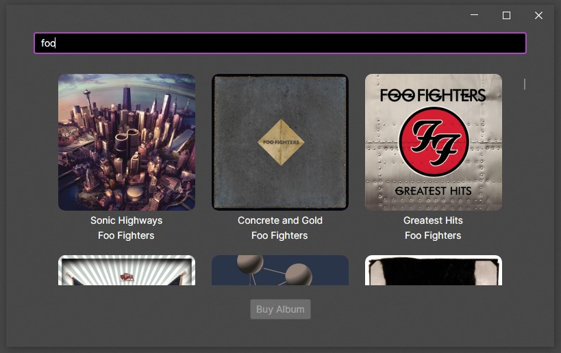
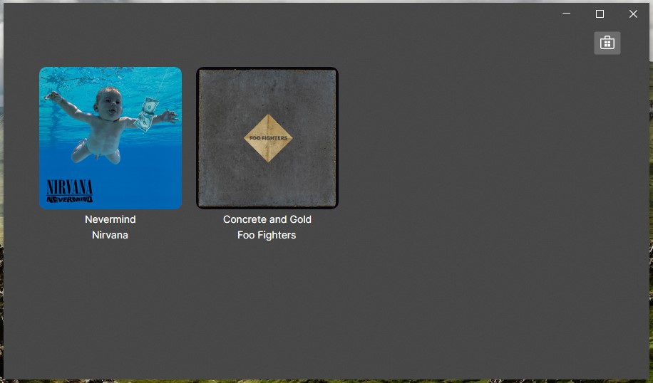

La aplicación está casi terminada, toda la funcionalidad básica está implementada y solo faltan un par de mejoras. La más importante es mostrar las portadas de los álbumes, ver la imagen del álbum aumentará mucho el atractivo.

## Mostrar la imagen

La dificultad reside en obtener la imagen a partir de la url, debemos descargar los datos de la imagen de forma asíncrona para mostrarla como un mapa de bits en la interfaz.

Vamos a crear un nuevo servicio que se encargue de esta tarea: ``Services/CoverService.cs``.

````cs title=CoverService.cs
using System.IO;
using System.Net.Http;
using System.Threading.Tasks;
using Avalonia.MusicStore.Models;

namespace Avalonia.MusicStore.Services;

public class CoverService
{
    private static CoverService? _instance;

    public static CoverService Instance => _instance ??= new CoverService();
    
    private static readonly HttpClient SHttpClient = new();

    public async Task<Stream> LoadCoverBitmapAsync(Album album)
    {
        var data = await SHttpClient.GetByteArrayAsync(album.CoverUrl);
        return new MemoryStream(data);
    } 
}
````

Ahora usaremos este nuevo servicio en nuestro ``AlbumViewModel`` para que, a partir de la url que tiene el modelo cargue la imagen en su propiedad ``Cover`` que es un ``Bitmap``.

````cs title=AlbumViewModel.cs
    private readonly CoverService _coverService = CoverService.Instance;

    public async Task LoadCover()
    {
        await using var imageStream = await _coverService.LoadCoverBitmapAsync(Album);
        Cover = Bitmap.DecodeToWidth(imageStream, 400);;
    }
````

Podríamos pensar en llamar a esta función al crear el ViewModel en el constructor, simplificaría las cosas pero perderíamos control sobre la ejecución de estas tareas. Cuando buscamos álbumes el servicio de música nos puede devolver cientos de resultados y descargar la imagen de todos ellos es una tarea bastante pesada.

Queremos tener la capacidad de detener la descarga de las imágenes si fuese necesario, por ejemplo si se cierra la ventana, si se cambia el término de búsqueda, etc. Por ello, debemos desencadenar las descargas en el punto de la aplicación en el que se realiza la búsqueda, en el ``MusicStoreViewModel``.

````cs title=MusicStoreWindow.cs ins={1,8-11,17,22-33}
    private CancellationTokenSource? _cancellationTokenSource;

    private async void Search(string? query)
    {
        IsBusy = true;
        SearchResults = [];

        _cancellationTokenSource?.Cancel();
        _cancellationTokenSource = new CancellationTokenSource();
        var cancellationToken = _cancellationTokenSource.Token;

        if (!string.IsNullOrWhiteSpace(query))
        {
            var albums = await AlbumService.SearchAsync(query);
            SearchResults = albums.Select(album => new AlbumViewModel(album)).toArray();

            LoadCovers(cancellationToken);
        }

        IsBusy = false;
    }
    private async void LoadCovers(CancellationToken cancellationToken)
    {
        foreach (var album in SearchResults)
        {
            await album.LoadCover();

            if (cancellationToken.IsCancellationRequested)
            {
                return;
            }
        }
    }
````

Creamos un nuevo método asíncrono que recorre los álbumes y lanza la descarga de las imágenes para cada uno de ellos. Además este método recibe un token que nos permite avisar si queremos cancelar la tarea. Lanzamos esta tarea cuando en cada búsqueda y cuando se realizan nuevas búsquedas cancelamos la tarea anterior.

¡Ya empezamos a ver las carátulas en la búsqueda!



## Cancelar al cerrar la ventana

Ya cancelamos la descarga de imágenes cuando se cambia la búsqueda, pero aún no lo hacemos cuando la ventana de búsqueda se cierra, para ello debemos activara el token de cancelación en ese momento. Vamos a implementar la interfaz ``IDisposable`` en nuestro ViewModel y liberar todos los recursos cuando se cierre la ventana.

````cs title=MusicStoreViewModel.cs
public partial class MusicStoreViewModel : ViewModelBase, IDisposable
{
    // ...
    private readonly IDisposable _searchSubscription;

    public MusicStoreViewModel()
    {
        // Nos suscribimos al Subject para manejar los cambios con debounce
        _searchSubscription = _searchTextSubject
            .Throttle(TimeSpan.FromMilliseconds(_debounceDelay)) // Aplicamos el debounce
            .DistinctUntilChanged() // Evitamos emitir valores duplicados consecutivos
            .Subscribe(Search);
    }

    // ...
    public void Dispose()
    {
        // Liberamos la suscripción y el Subject al finalizar
        _searchSubscription.Dispose();
        _searchTextSubject.Dispose();
    }
}
````

Aprovechamos también para liberar la suscripción al campo de texto, asegurandonos de no mantener objetos que ya no está en la pantalla en memoria.

Ahora en el _code behind_ de nuestra ventana liberaremos los recursos del ViewModel.

````cs title=MusicStoreWindow.axaml.cs ins={4-7}
    protected override void OnUnloaded(RoutedEventArgs e)
    {
        _subscription?.Dispose();
        if (DataContext is MusicStoreViewModel vm)
        {
            vm.Dispose();
        }
        base.OnUnloaded(e);
    }
````

## Guardar y mostrar covers de la colección

Ya vemos las covers cuando buscamos, pero falta ver las de nuestra colección, usaremos el mismo método para descargarlas, pero además guardaremos la imagen en la caché, puesto que estos álbumes se cargarán siempre que se use la aplicación y descargarlas cada vez, además eso también nos permitirá verlas sin conexión.

````cs title=MainWindowViewModel.cs del={8} ins={9-11}
    private readonly CacheService _cacheService = CacheService.Instance;

    private async void LoadAlbums()
    {
        var albums = await _cacheService.LoadCachedAsync();
        foreach (var album in albums)
        {
            Albums.Add(new AlbumViewModel(album));
            AlbumViewModel vm = new AlbumViewModel(album);
            Albums.Add(vm);
            vm.LoadCover();
        }
    }
````
Ya se están descargando, pero no las estamos guardando en local, debemos añadir esa lógica al servicio de caché y comprobar si existen antes de descargarlas.

````cs title=AlbumViewModel.cs ins={4-14}
    public async Task SaveToDiskAsync()
    {
        await _cacheService.SaveAsync(Album);

        if (Cover != null)
        {
            var bitmap = Cover;

            await Task.Run(() =>
            {
                using var fs = _cacheService.SaveCoverBitmapStream(Album);
                bitmap.Save(fs);
            });
        }
    }
````

````cs title=CacheService.cs
    public FileStream? LoadImage(Album album)
    {
        return File.Exists(CachePath(album)+ ".bmp") ? File.OpenRead(CachePath(album) + ".bmp") : null;
    }
````

````cs title=CoverService.cs inst={1,5-9}
    private readonly CacheService _cacheService = CacheService.Instance;

    public async Task<Stream> LoadCoverBitmapAsync(Album album)
    {
        var cacheImage = _cacheService.LoadImage(album);
        if (cacheImage != null)
        {
            return cacheImage;
        }
        var data = await SHttpClient.GetByteArrayAsync(album.CoverUrl);
        return new MemoryStream(data);
    }
````

Ya tenemos nuestra colección con carátulas, y cargadas desde la caché.


